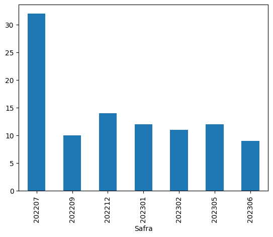

# featime

<!-- WARNING: THIS FILE WAS AUTOGENERATED! DO NOT EDIT! -->

``` python
from featime.featime import *
```

``` python
import pandas as pd
import random
import numpy as np
import matplotlib.pyplot as plt
pd.options.display.max_columns = None
```

Criando variáveis numéricas e categóricas

## Install

``` sh
pip install featime
```

## How to use

### Criando dataframe aleatório

Criando DataFrame com variáveis categóricas e numéricas

``` python
# Criando o DataFrame
data = {
    'ID_cliente': [random.choice(list(range(1, 101)))for _ in range(100)],
    'data_transacao': [random.choice([202207, 202208, 202209, 202210, 202211, 202212, 202301, 202302, 202303, 202304, 202305,
                                      202306, 202307, 202308]) for _ in range(100)],
    'Feat_cat': [random.choice(['A', 'B', 'C']) for _ in range(100)],    
    'Feat_num1': np.random.randint(0, 100, size=100),
    'Feat_num2': np.random.randint(0, 100, size=100)
}
df = pd.DataFrame(data)
```

``` python
df.head()
```

<div>
<style scoped>
    .dataframe tbody tr th:only-of-type {
        vertical-align: middle;
    }
&#10;    .dataframe tbody tr th {
        vertical-align: top;
    }
&#10;    .dataframe thead th {
        text-align: right;
    }
</style>

|     | ID_cliente | data_transacao | Feat_cat | Feat_num1 | Feat_num2 |
|-----|------------|----------------|----------|-----------|-----------|
| 0   | 43         | 202211         | A        | 50        | 64        |
| 1   | 53         | 202210         | B        | 81        | 1         |
| 2   | 30         | 202307         | A        | 47        | 86        |
| 3   | 13         | 202305         | B        | 81        | 21        |
| 4   | 41         | 202207         | B        | 56        | 61        |

</div>

O Dataframe criado tem o ID do cliente aleatório, podendo se repetir em
datas diferentes,

``` python
df.groupby('ID_cliente')['data_transacao'].value_counts().sort_values(ascending=False)
```

    ID_cliente  data_transacao
    64          202304            3
    26          202209            2
    92          202303            2
    1           202208            1
    66          202304            1
                                 ..
    36          202211            1
    35          202301            1
    30          202209            1
                202307            1
    100         202306            1
    Name: count, Length: 96, dtype: int64

### Ajustando datas

A variável data_transacao é a data que ocorreu algum tipo de transação
na base. Para o nosso exemplo, teremos a seguinte distribuição das
datas:

``` python
plt.figure(figsize=(5,2))
df['data_transacao'].value_counts().sort_index().plot.bar(color = '#23238E')
```

    <Axes: xlabel='data_transacao'>



As `datas suportadas` precisam estar no formato `YYYYMMDD`. Por isso,
vamos modificar a transação para o primeiro dia dos mês,

``` python
df['data_transacao'] = df['data_transacao'].apply(lambda x: str(x)+'01')
```

Para criarmos variáveis em janelas, vamos criar uma data de referência
chamada “safra_ref”. Ela também precisa estar no formato YYYYMMDD

``` python
df['safra_ref'] = '20230701'
```

### Variáveis numéricas

A partir do ID_cliente do cliente e da data de transação, agrupamos as
entradas e calculamos variáveis do tipo ‘sum’, ‘mean’ e ‘count’ que são
fornecidas em forma de lista em ‘operations’ para variáveis numéricas.
As variáveis utilizadas são listadas em ‘value_var’ e calculadas nas
janelas de tempo em ‘window’ para a data de referência em
‘ref_time_var’.

``` python
id_cols = ['ID_cliente','safra_ref']
trns_time = 'data_transacao'
ref_time = 'safra_ref'
value_var = ['Feat_num1','Feat_num2']
window = [-1,-2,-3,-6,-9,-12,-15]
operations = ['sum','mean','count']

df_vars_num = featime_in_time(df,id_cols,trns_time,ref_time,value_var,window,operations)
```

``` python
df_vars_num.head()
```

<div>
<style scoped>
    .dataframe tbody tr th:only-of-type {
        vertical-align: middle;
    }
&#10;    .dataframe tbody tr th {
        vertical-align: top;
    }
&#10;    .dataframe thead th {
        text-align: right;
    }
</style>

|     | ID_cliente | safra_ref  | Feat_num1_sum_1M | Feat_num1_mean_1M | Feat_num1_count_1M | Feat_num1_sum_2M | Feat_num1_mean_2M | Feat_num1_count_2M | Feat_num1_sum_3M | Feat_num1_mean_3M | Feat_num1_count_3M | Feat_num1_sum_6M | Feat_num1_mean_6M | Feat_num1_count_6M | Feat_num1_sum_9M | Feat_num1_mean_9M | Feat_num1_count_9M | Feat_num1_sum_12M | Feat_num1_mean_12M | Feat_num1_count_12M | Feat_num1_sum_15M | Feat_num1_mean_15M | Feat_num1_count_15M | Feat_num2_sum_1M | Feat_num2_mean_1M | Feat_num2_count_1M | Feat_num2_sum_2M | Feat_num2_mean_2M | Feat_num2_count_2M | Feat_num2_sum_3M | Feat_num2_mean_3M | Feat_num2_count_3M | Feat_num2_sum_6M | Feat_num2_mean_6M | Feat_num2_count_6M | Feat_num2_sum_9M | Feat_num2_mean_9M | Feat_num2_count_9M | Feat_num2_sum_12M | Feat_num2_mean_12M | Feat_num2_count_12M | Feat_num2_sum_15M | Feat_num2_mean_15M | Feat_num2_count_15M |
|-----|------------|------------|------------------|-------------------|--------------------|------------------|-------------------|--------------------|------------------|-------------------|--------------------|------------------|-------------------|--------------------|------------------|-------------------|--------------------|-------------------|--------------------|---------------------|-------------------|--------------------|---------------------|------------------|-------------------|--------------------|------------------|-------------------|--------------------|------------------|-------------------|--------------------|------------------|-------------------|--------------------|------------------|-------------------|--------------------|-------------------|--------------------|---------------------|-------------------|--------------------|---------------------|
| 0   | 43         | 2023-07-01 | NaN              | NaN               | NaN                | NaN              | NaN               | NaN                | NaN              | NaN               | NaN                | 1.0              | 1.0               | 1.0                | 123.0            | 30.75             | 4.0                | 158.0             | 31.6               | 5.0                 | 158.0             | 31.6               | 5.0                 | NaN              | NaN               | NaN                | NaN              | NaN               | NaN                | NaN              | NaN               | NaN                | 92.0             | 92.0              | 1.0                | 250.0            | 62.5              | 4.0                | 305.0             | 61.0               | 5.0                 | 305.0             | 61.0               | 5.0                 |
| 1   | 53         | 2023-07-01 | NaN              | NaN               | NaN                | NaN              | NaN               | NaN                | NaN              | NaN               | NaN                | NaN              | NaN               | NaN                | 81.0             | 81.00             | 1.0                | 111.0             | 55.5               | 2.0                 | 111.0             | 55.5               | 2.0                 | NaN              | NaN               | NaN                | NaN              | NaN               | NaN                | NaN              | NaN               | NaN                | NaN              | NaN               | NaN                | 1.0              | 1.0               | 1.0                | 97.0              | 48.5               | 2.0                 | 97.0              | 48.5               | 2.0                 |
| 2   | 30         | 2023-07-01 | NaN              | NaN               | NaN                | NaN              | NaN               | NaN                | NaN              | NaN               | NaN                | NaN              | NaN               | NaN                | NaN              | NaN               | NaN                | 69.0              | 34.5               | 2.0                 | 69.0              | 34.5               | 2.0                 | NaN              | NaN               | NaN                | NaN              | NaN               | NaN                | NaN              | NaN               | NaN                | NaN              | NaN               | NaN                | NaN              | NaN               | NaN                | 82.0              | 41.0               | 2.0                 | 82.0              | 41.0               | 2.0                 |
| 3   | 13         | 2023-07-01 | NaN              | NaN               | NaN                | 81.0             | 81.0              | 1.0                | 81.0             | 81.0              | 1.0                | 81.0             | 81.0              | 1.0                | 142.0            | 71.00             | 2.0                | 142.0             | 71.0               | 2.0                 | 142.0             | 71.0               | 2.0                 | NaN              | NaN               | NaN                | 21.0             | 21.0              | 1.0                | 21.0             | 21.0              | 1.0                | 21.0             | 21.0              | 1.0                | 43.0             | 21.5              | 2.0                | 43.0              | 21.5               | 2.0                 | 43.0              | 21.5               | 2.0                 |
| 4   | 41         | 2023-07-01 | NaN              | NaN               | NaN                | NaN              | NaN               | NaN                | NaN              | NaN               | NaN                | 35.0             | 35.0              | 1.0                | 35.0             | 35.00             | 1.0                | 91.0              | 45.5               | 2.0                 | 91.0              | 45.5               | 2.0                 | NaN              | NaN               | NaN                | NaN              | NaN               | NaN                | NaN              | NaN               | NaN                | 43.0             | 43.0              | 1.0                | 43.0             | 43.0              | 1.0                | 104.0             | 52.0               | 2.0                 | 104.0             | 52.0               | 2.0                 |

</div>

``` python
df[df['ID_cliente']==43]
```

<div>
<style scoped>
    .dataframe tbody tr th:only-of-type {
        vertical-align: middle;
    }
&#10;    .dataframe tbody tr th {
        vertical-align: top;
    }
&#10;    .dataframe thead th {
        text-align: right;
    }
</style>

|     | ID_cliente | data_transacao | Feat_cat | Feat_num1 | Feat_num2 | safra_ref |
|-----|------------|----------------|----------|-----------|-----------|-----------|
| 0   | 43         | 20221101       | A        | 50        | 64        | 20230701  |
| 26  | 43         | 20221201       | C        | 24        | 63        | 20230701  |
| 63  | 43         | 20221001       | C        | 48        | 31        | 20230701  |
| 79  | 43         | 20220801       | C        | 35        | 55        | 20230701  |
| 81  | 43         | 20230101       | C        | 1         | 92        | 20230701  |

</div>

### Variáveis categóricas

Para variáveis categóricas, as operações são ‘nunique’ e mode.

``` python
id_cols = ['ID_cliente','safra_ref']
trns_time = 'data_transacao'
ref_time = 'safra_ref'
value_var = ['Feat_cat']
window = [-1,-2,-3,-6,-9,-12,-15]
operations = ['nunique', mode]

df_vars_cat = featime_in_time(df,id_cols,trns_time,ref_time,value_var,window,operations)
```

``` python
df_vars_cat.head()
```

<div>
<style scoped>
    .dataframe tbody tr th:only-of-type {
        vertical-align: middle;
    }
&#10;    .dataframe tbody tr th {
        vertical-align: top;
    }
&#10;    .dataframe thead th {
        text-align: right;
    }
</style>

|     | ID_cliente | safra_ref  | Feat_cat_nunique_1M | Feat_cat_mode_1M | Feat_cat_nunique_2M | Feat_cat_mode_2M | Feat_cat_nunique_3M | Feat_cat_mode_3M | Feat_cat_nunique_6M | Feat_cat_mode_6M | Feat_cat_nunique_9M | Feat_cat_mode_9M | Feat_cat_nunique_12M | Feat_cat_mode_12M | Feat_cat_nunique_15M | Feat_cat_mode_15M |
|-----|------------|------------|---------------------|------------------|---------------------|------------------|---------------------|------------------|---------------------|------------------|---------------------|------------------|----------------------|-------------------|----------------------|-------------------|
| 0   | 43         | 2023-07-01 | NaN                 | NaN              | NaN                 | NaN              | NaN                 | NaN              | 1.0                 | C                | 2.0                 | C                | 2.0                  | C                 | 2.0                  | C                 |
| 1   | 53         | 2023-07-01 | NaN                 | NaN              | NaN                 | NaN              | NaN                 | NaN              | NaN                 | NaN              | 1.0                 | B                | 1.0                  | B                 | 1.0                  | B                 |
| 2   | 30         | 2023-07-01 | NaN                 | NaN              | NaN                 | NaN              | NaN                 | NaN              | NaN                 | NaN              | NaN                 | NaN              | 2.0                  | B                 | 2.0                  | B                 |
| 3   | 13         | 2023-07-01 | NaN                 | NaN              | 1.0                 | B                | 1.0                 | B                | 1.0                 | B                | 2.0                 | A                | 2.0                  | A                 | 2.0                  | A                 |
| 4   | 41         | 2023-07-01 | NaN                 | NaN              | NaN                 | NaN              | NaN                 | NaN              | 1.0                 | C                | 1.0                 | C                | 2.0                  | B                 | 2.0                  | B                 |

</div>

``` python
df[df['ID_cliente']==43]
```

<div>
<style scoped>
    .dataframe tbody tr th:only-of-type {
        vertical-align: middle;
    }
&#10;    .dataframe tbody tr th {
        vertical-align: top;
    }
&#10;    .dataframe thead th {
        text-align: right;
    }
</style>

|     | ID_cliente | data_transacao | Feat_cat | Feat_num1 | Feat_num2 | safra_ref |
|-----|------------|----------------|----------|-----------|-----------|-----------|
| 0   | 43         | 20221101       | A        | 50        | 64        | 20230701  |
| 26  | 43         | 20221201       | C        | 24        | 63        | 20230701  |
| 63  | 43         | 20221001       | C        | 48        | 31        | 20230701  |
| 79  | 43         | 20220801       | C        | 35        | 55        | 20230701  |
| 81  | 43         | 20230101       | C        | 1         | 92        | 20230701  |

</div>
